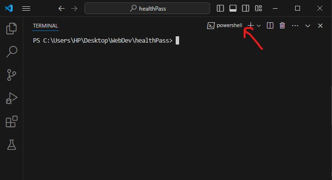
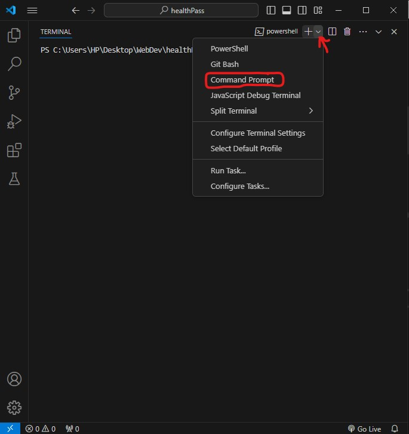

## Open vscode
1. Click on New Terminal from the VS Code hamburger menu.


2. You will see the Powershell terminal by default.



3. Click on the down arrow with the '+' icon and click on Command Prompt to create a new CMD terminal.



5. Now you have Powershell terminal and then Command Prompt terminal

6. Use the powershell terminal for linux commands and use Command Prompt to run "python manage.py check" and "python manage.py runserver"

For healtpass/ application
all paths with this <type:parameter> can not be accessed directly from
the web browser but the html files beside it are connected to them
check the files and just style them here it this path
```
cd SE_FOUNDATIONS_PROJECT\BSE-FOUNDATIONS-PROJECT-HEALTH-PASS\easy_healthcare\healthpass\templates\healthpass
```

1. user_signup - django_user.html
2. user_home - user_home.html
3. custom_signup - custom_user.html
4. custom_login - custom_login.html
5. custom_home - custom_home.html
6. custom_logout - no html
7. custom_ban - custom_ban.html
8. custom_password_reset - custom_password_reset_form.html 
9. custom_password_reset_done - custom_password_reset_done.html 
10. custom_reset/<str:uidb64>/<str:token> - custom_reset_confirm_form.html
11. custom_reset_done - custom_reset_done.html
12. custom_password_reset_warning - custom_password_reset_warning.html
13. blood_work_create - bloodwork_form.html
14. blood_work_read - bloodwork_list.html
15. blood_work_read_update - bloodwork_updatelist.html
16. blood_work_update/<int:pk> - bloodwork_form.html
17. blood_work_read_delete - bloodwork_deletelist.html
18. blood_work_delete/<int:pk> - bloodwork_confirm_delete.html
19. general_info_create - generalinfo_form.html
20. general_info_read - generalinfo_list.html
21. general_info_read_update - generalinfo_updatelist.html
22. general_info_update/<int:pk> - generalinfo_form.html
23. general_info_read_delete - generalinfo_deletelist.html
24. general_info_delete/<int:pk> - generalinfo_confirm_delete.html
25. urinalysis_create - urinalysis_form.html
26. urinalysis_read - urinalysis_list.html
27. urinalysis_read_update - urinalysis_updatelist.html
28. urinalysis_update/<int:pk> - urinalysis_form.html
29. urinalysis_read_delete - urinalysis_deletelist.html
30. urinalysis_delete/<int:pk> - urinalysis_confirm_delete.html
31. custom_blood_work_read - custom_bloodwork_list.html
32. custom_general_info_read - custom_generalinfo_list.html 
33. custom_urinalysis_read - custom_urinalysis_list.html

For accounts/ application
all paths with this <type:parameter> can not be accessed directly from
the web browser but the html files beside it are connected to them
check the files and just style them
this is the path:
```
cd SE_FOUNDATIONS_PROJECT\BSE-FOUNDATIONS-PROJECT-HEALTH-PASS\easy_healthcare\healthpass\templates\registration
```
1. login - login.html
2. logout - no html
3. password_reset - password_reset_form.html
4. password_reset/done - password_reset_done.html
5. reset/<str:uidb64>/<str:token> - password_reset_confirm.html
6. reset/done - password_reset_complete.html

# Working with the html file, css file and js file
navigate to this directory
```
cd SE_FOUNDATIONS_PROJECT\BSE-FOUNDATIONS-PROJECT-HEALTH-PASS\easy_healthcare\healthpass
```
list directories and you would see files and folders
```
ls
```
then would see static folder, then change directory to it
```
cd static
```
then inside of static list directories
```
ls
```
then you would see styles, scripts, and images folder
put css file in styles folder
```
cd styles
```
put javascript files in scripts folder
```
cd scripts
```
put images files in images folder
```
cd images
```
then move to the folder of the html files you are working on
```
cd SE_FOUNDATIONS_PROJECT\BSE-FOUNDATIONS-PROJECT-HEALTH-PASS\easy_healthcare\healthpass\templates\healthpass
```
or
```
cd SE_FOUNDATIONS_PROJECT\BSE-FOUNDATIONS-PROJECT-HEALTH-PASS\easy_healthcare\healthpass\templates\registration
```
In your file put this in the head tag of your html as the first thing before title, meta tags
```

```
before calling the style sheet in the link tag, the js in the script tag, and images in the image tag
```
<link rel="stylesheet" href="">
```
```
<script src=""></script>
```
```

```
**then go back to this on cmd not powershell, use cmd on vscode to be running this commands below**
```
cd SE_FOUNDATIONS_PROJECT\BSE-FOUNDATIONS-PROJECT-HEALTH-PASS\easy_healthcare
```
the run this commands
```
python manage.py check
```
```
python manage.py runserver
```
then go back to the top of the readme to see what i said you should do after running this commands
**Use vscode powershell to actually edit the scripts i.e css, js, and html**
